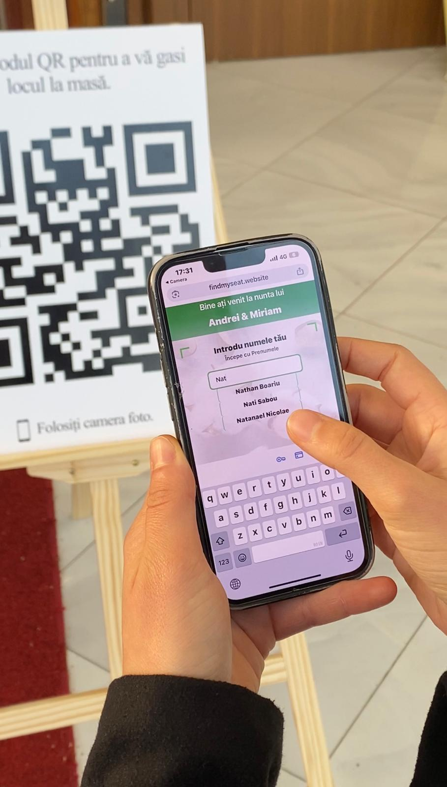
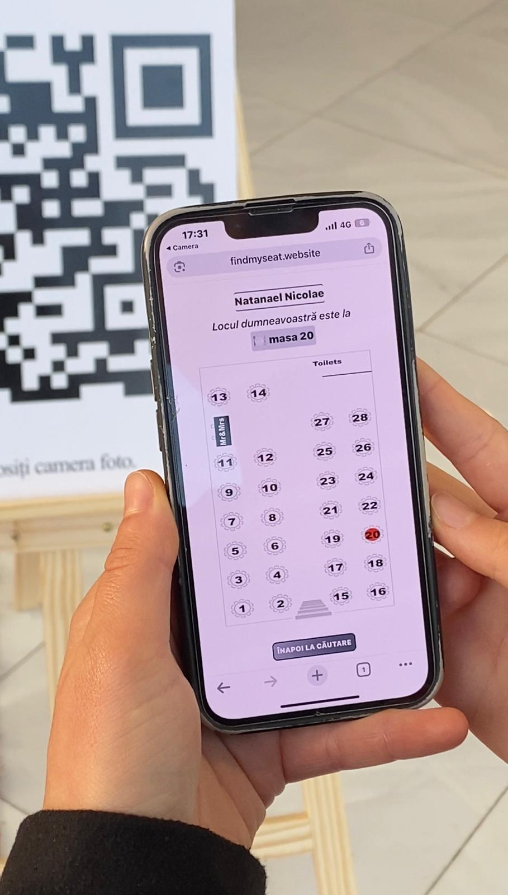

# 🪑🍽️🍷 Find My Seat

**Find My Seat** is a wedding guest seating web app that helps guests quickly find which table they are assigned to at the wedding reception.

It is designed for ease of use, especially on mobile devices, and can be accessed directly via QR code shared with guests.

---

## Demo

### Scan


### Search Page



### Table View



## 🚀 Run the App with Docker

This project is available as prebuilt Docker images on Docker Hub:

- **Frontend:** [natinicolae/find_my_seat_frontend](https://hub.docker.com/r/natinicolae/find_my_seat_frontend)
- **Backend:** [natinicolae/find_my_seat_backend](https://hub.docker.com/r/natinicolae/find_my_seat_backend)

---

### 🧩 Run Containers Individually

If you only want to pull and run the Docker images (without cloning the repository),  
you can start each container separately with the following commands:

```bash
# 1. Pull both images
docker pull natinicolae/find_my_seat_backend:latest
docker pull natinicolae/find_my_seat_frontend:latest

# 2. Start the backend
docker run -d -p 8000:8000 --name find_my_seat_backend natinicolae/find_my_seat_backend:latest

# 3. Start the frontend
docker run -d -p 3000:80 --name find_my_seat_frontend natinicolae/find_my_seat_frontend:latest


## 💡 What It Does

- Guests arrive at the venue, scan a QR code.
- They enter their name.
- The app displays the guest's full name and their assigned table.
- If they have children, their seats will also be shown.
- A full interactive floor plan of the dining area is displayed, with **all tables visible**.
- The guest’s table is **highlighted**, so they can quickly locate it in the venue.

---

## Project Overview

The project is made of two main parts:

### 🖧 Backend

- **Folder:** `backend/`
- **Tech Stack:** Python (Flask)
- **Responsibilities:**
  - Serves the guest database, including names and assigned tables
  - Provides a specific image for each table, based on where the guest is seated
  - Responds to frontend requests with this data through a simple REST API

### 🌐 Frontend

- **Folder:** `frontend/`
- **Tech Stack:** React
- **Responsibilities:**
  - Provides a welcome page where users enter their name to find their seating information.
  - Fetches guest data and table images from the backend API
  - Displays the guest's name, assigned table, and children’s seating (if applicable)
  - Shows an interactive floor plan highlighting the guest’s table for easy location
  - Designed to work smoothly on mobile devices for quick access at the venue

## 🧰 Technical Overview

This section provides a technical breakdown of how the **Find My Seat** application works under the hood — from the moment a guest scans the QR code, to the final display of their assigned table on the floor plan.

---

### 🌐 Request Flow – Step by Step

1. **QR Code Scan & Domain Routing**

   - A guest scans a **QR code** that points to the app's **custom domain** (e.g. `https://findmyseat.app`).
   - This domain is configured to forward all requests to a **Virtual Machine (VM)** hosted on **Google Cloud Platform (GCP)**.

2. **VM Setup & NGINX**

   - The GCP VM runs:
     - An **NGINX** server (reverse proxy)
     - A **React** frontend build
     - A **Flask (Python)** backend API
   - NGINX:
     - Receives incoming **HTTP** requests
     - Forces them to **HTTPS**
     - Serves the React frontend and proxies API requests to Flask

3. **Frontend Behavior (React)**

   - When the app loads in the browser, **React immediately fetches the full guest list** from the backend.
   - As the guest begins typing into the name input field (starting from 3 characters), React **filters the full list locally** to show **autocomplete suggestions** in real time.
   - A dropdown list of matching names appears below the input field.

4. **Name Validation Logic**

   - If the guest selects a name from the list → React knows the exact selected name and proceeds to the next step.
   - If the guest manually types and presses "Enter"/"OK" without selecting a valid name:
     - If the input is incomplete or incorrect → the app displays an **error message**.
     - This ensures only **valid, complete names** are accepted before continuing.

5. **Backend Role (Flask API)**

   - Once a valid name is selected, React sends a request to the Flask backend to retrieve seating data.
   - The backend responds with:
     - The **assigned table number**
     - Any **children's table** (if applicable)
     - A **venue floor plan image**, where the guest’s table is highlighted

6. **Results Page (Step 2)**
   - The next page shows:
     - Guest’s **full name**
     - Their **assigned table**
     - Table for their **children** (if present)
     - A full **venue floor plan image**, including:
       - All tables
       - Bride & groom's table
       - Bar, restrooms, other key areas
     - The guest’s table is **highlighted visually** for easy identification

---

## ☁️ Infrastructure & Deployment

| Component      | Technology                  | Description                                                                           |
| -------------- | --------------------------- | ------------------------------------------------------------------------------------- |
| **Cloud Host** | Google Cloud Platform (GCP) | A single virtual machine running the entire stack                                     |
| **Web Server** | NGINX                       | Handles HTTPS, serves frontend, proxies API requests                                  |
| **Frontend**   | React (served via NGINX)    | Lightweight SPA optimized for mobile access                                           |
| **Backend**    | Flask (Python)              | REST API that returns guest info, assigned tables, and personalized floor plan images |
| **Domain**     | Custom domain               | Configured to point to the GCP VM                                                     |
| **Security**   | HTTPS (via NGINX)           | All traffic is forced to HTTPS (e.g. Let's Encrypt)                                   |

---

## 🔒 UX & Input Validation Logic

- **Local autocomplete** after typing 3 characters
- **Preloaded guest list** for instant suggestions (no per-keystroke API calls)
- Validation gates prevent:
  - Incomplete names
  - Invalid manual entries
- Clean error messages for unmatched names
- Smooth transition between pages
- Guest’s table clearly **highlighted on the map** for easy orientation
```
